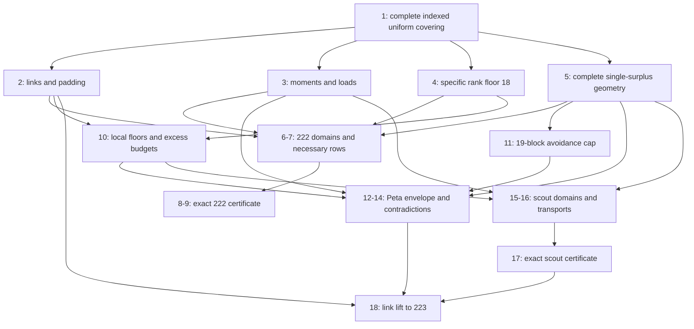

# Dependency graph and assumption-to-code map

Node numbers refer to [PROOFS.md](PROOFS.md). Solid dependencies below
are semantic; finite checks accompany them and are not substitute premises.

222 is not a dependency of either 223 route. The companion analytic 221
proof is historical context, not a dependency of the 222 certificate,
because padding covers smaller sizes. Pētā's stage-01 numerical search,
determinant work and later generalized avoidance statement are not
dependencies of this package. Scout's numerical solver supplied weights,
but solver feasibility, optimality and tolerances are not dependencies of
the exact certificate.

| Semantic obligation | Proof location | Code/check | What executable evidence cannot establish |
| --- | --- | --- | --- |
| Every block is a legal subset; complete coverage quantifies over all t-subsets | 1 | `independent223.family_counts`, toy fixtures | Universal coverage of arbitrary target families |
| Link completeness and nonempty occurrence padding | 2,18 | `independent223.small_fixtures` | Universal point-link mapping and recurrence |
| Rank floor, including matching partner uniqueness and a=0 | 4 | `verify_audit.direct_floor` | Real positive definiteness and rank for all incidence matrices |
| Single surplus follows from complete extension coverage | 4,5 | `verify_toy_triple`, complete/incomplete fixtures | Global semantic implication from coverage |
| Tight-set charging capacities and exact intersections | 5,7,12,16 | toy tight pairs; reconstructed cut coefficients | Universality of capacities 1,3,4 |
| Integer nonnegative excess budgets and full domains | 6,10,15 | `independent222.build_model`, `independent223.build_model` | Necessary status of the integer caps for arbitrary covers |
| M/N support containment and extension surplus | 6,15 | full variable equality comparison; toy supported incidences | Universality of the forward profile map |
| Moments include repeated block intersections | 3,8,17 | both matrix reconstructions; root third-moment tests; repeated fixture | Universal double-counting identity |
| 19-block avoidance, all m=16..19 cases | 11 | `support_audit`, `extended_support_checks` | Every cover maps to the graph and repeated partner constraints |
| All degree/chord cases and global envelope | 10,13,14 | `peta_arithmetic`: 557 exact cases, 20 envelope slacks | All actual degrees belong to the specified cases |
| Correct inequality orientation and full finite corrections | 8,9,17 | both `replay_certificate` functions; mutation tests | That every modeled row holds for an actual cover |
| 16B>=54*66 and integer rounding | 18 | `verify_all.lifting` | All target point links meet the local theorem hypotheses |

The two 223 routes share the indexed-cover domain, floor 18, pair floor
4, one-surplus tight-pair geometry, occurrence moments and final lifting.
They are distinct arguments with a shared semantic failure surface. The
analytic route additionally needs avoidance; the scout certificate does
not. The support graph checks are an optional finite certificate for
avoidance and are unnecessary for the analytic proof in Lemma 11.

The verifier's forward-map claims are restricted to complete **integer**
cover profiles. Its LP certificates bound a larger real set. Some real
profiles or supported cells are unrealizable; excluding that larger set's
zero objective is sound. Conversely a feasible relaxed profile is not a
cover and cannot be used to infer an upper bound.
