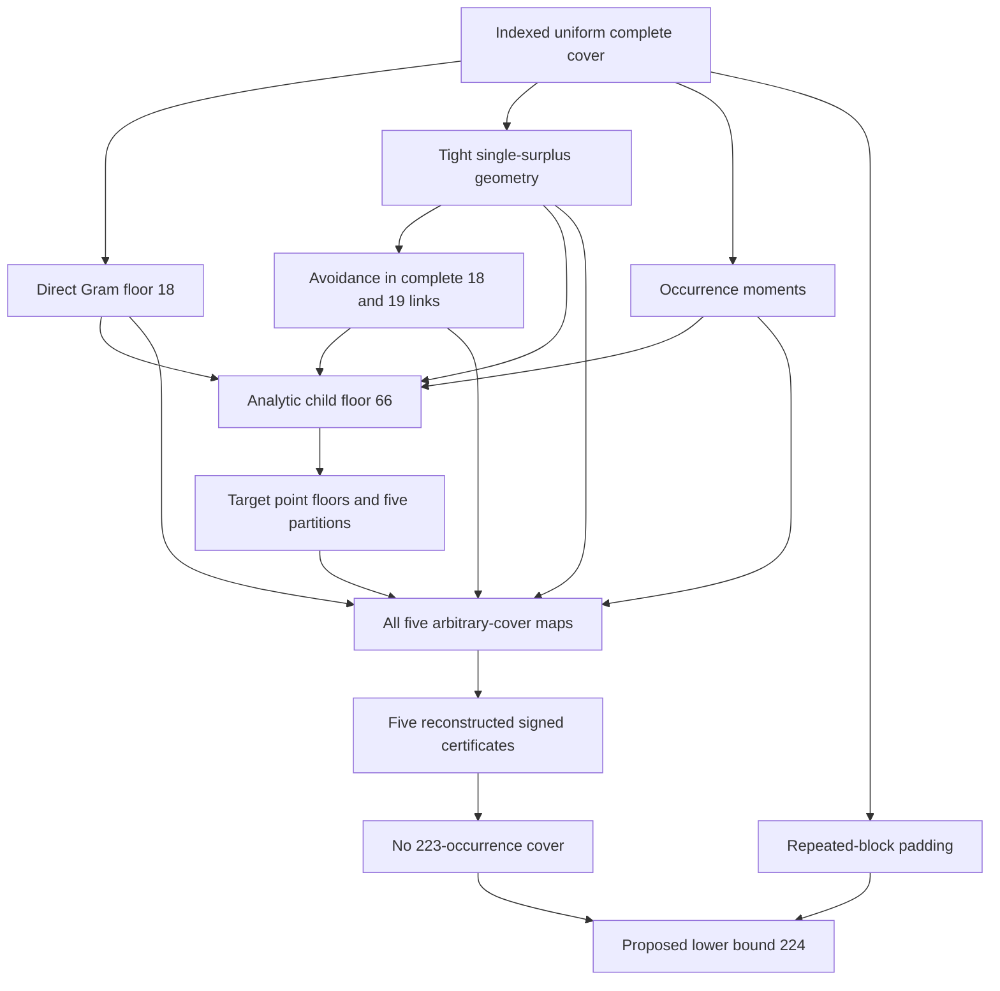

# Dependencies, assumptions and executable trust boundary

The exact [frozen dependency graph](package/PROOF_DEPENDENCIES.json) is
validated for equality, declared nodes and acyclicity. It has this route:

| Proof obligation | Source and numbered steps | Executable check and limit |
| --- | --- | --- |
| Completeness, distinct points inside blocks, indexed repetitions | STEP_BY_STEP_224.md 1-2; package/proof/ASSEMBLY.md | Frozen dependency and source inventory checks; semantics require reading the definition |
| Gram floor18 and rank<=occurrences | Steps3-4; child semantic certificate | audit/verify_audit.py direct_floor polynomial checks; package/verify.py child_arithmetic substitution. Neither computes rank of every target covering |
| Complete 18/19 link avoidance; four tight occurrences; unique repeat partner | Step5; case proofs | Child finite contradiction domains; older audit's complete support graphs. These computations do not license using avoidance on incomplete links |
| Child degree domain18..39, excess21, all chord cases | Step6; CHILD_BOUND_66.md | package/verify.py child_arithmetic checks all permitted integer arguments, final -63/-7086 |
| Point-link lifting and full excess partition list | Steps7-8; ASSEMBLY | check_ledger, partitions, profile; assignment count395010. No target-cover enumeration |
| Pair budgets, normal and exceptional caps | Steps9-10; MULTIPLICITY_PROOF and case maps | All reconstructor variables, bounds and metadata; all endpoint capacities, including normal/exceptional distinctions |
| Real subset inclusions and equal-block intersections | Steps10-11; each case proof | validate compares every variable and row with complete reconstructed dictionaries; n16 retention control |
| Same-class pair weight counted twice; unique-class pair absence | Step11; each case proof | joint_count/column/vertex_load rows in every reconstruct_CASE module; case211 historic mutation controls retained as review projections |
| Weak pair-link cap15 and tight triple charges | Steps4-5,10-11 | Exact M/N domain reconstruction, tight rows; the semantic argument is independently reviewed ordinary mathematics |
| Endpoint own-edge subtraction, both endpoint budgets, all thresholds | Step12; CASE1111_ENDPOINT and cases4/31/22/211 | endpoint_residual_link rows reconstructed fully; no scalar T36/disjointness row added |
| Unique exceptional high triple for seven case1111 cuts | Steps9/12; CASE1111_LINKS | exceptional_link37..43 equality; uniqueness is an essential mathematical premise, not arbitrary histogram realizability |
| Actual moments give zero defects and H=0 | Steps2/11; COMMON_MODEL/ASSEMBLY | moment3/4_defect rows and four objective coefficients; no converse realization or minimal-defect assertion |
| Signed weak duality, finite residual correction | Step13; ASSEMBLY | replay uses all weights, selected endpoints, every column and every positive residual; integer/Fraction arithmetic only |
| Every case excluded, smaller sizes covered | Step14; ASSEMBLY | check_ledger/dependencies and exact negative uppers; padding_toys checks increment identities on its small full universe |

In the table, code under `package/` is rooted there and code under `audit/`
is rooted at the repository. The five reconstruction paths are
`package/audits/reconstruct_{4,31,22,211,1111}.py`, with functions
`reconstruct` and `validate`. `package/verify.py` invokes them after manifest
integrity checking, then performs `check_model`, `replay`, `child_arithmetic`,
`padding_toys` and `rejection_controls`. Its returned coefficient position
counts cover explicit entries and implicit zeros through full equality.

The portable reconstructors are extracted from the independent reviewer's
separately derived mathematics; they are not independent fresh research by
the packager. Their source and packaged hashes and AST extraction rule are
declared in PROVENANCE.json. Packaging validation adds process/inventory
controls and closed-form arithmetic counts. This adds a reproducible layer,
not a second claim of mathematical independence.

The trusted executable base is Python's standard library, the reviewed
verifiers and reconstruction code, and externally pinned file bytes.
Checksums cannot authenticate replacement of all verifiers and manifests
together. The AST import/call screen in the scout verifier is a useful
bounded hygiene check, not a sandbox against arbitrary hostile Python.
Inspect/pin the code before executing it. No proof-assistant kernel has
checked the universal semantic statements or Python implementation.

The broad reusable Pētā avoidance lemma is not needed or included in the
new224 dependency graph. Only the strict, parameter-specific complete
18/19-link argument is used. Separate historical center/disjointness toy
audits do not supply stronger coefficients to these frozen models.
