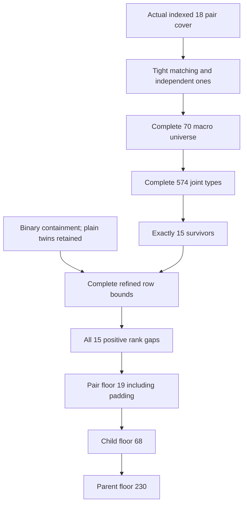

# Semantic proof, executable checks and dependencies

| Proof | Required universal fact | Reconstruction and scope |
|---|---|---|
|1-2|18 indexed 14-sets on 52 points cover every pair; no repeated point within a row |Hypothesis and repeated-row domain in PROOF; not inferred from a supplied marginal table |
|2|Degree>=4, exactly one repeated partner at degree 4, reciprocal internal matching |Semantic incidence count; all 70 actual basis Grams and positive inverse identities reconstructed |
|2|All-ones vector independent: projection norm<16<18; 8<=a<=17 |Gauss-Jordan, LDL and positive-Schur bordering independently reconstruct the basis; toy boundary shows independence is parameter-specific |
|3|Normal degree excess D=a-8, external partner H=a-2j, disjoint tight supports |Complete joint multiplicities and actual cross vectors; equal types at different points retain disjoint supports |
|4|Residual Gram PSD/rank<=17-a; correct diagonal/off coefficients and exact row load 13r-51-h |Actual basis inversion/cross multiplication in each checker; closed producer formula not trusted as an independent reconstruction |
|5-6|Trace-rank inequality and relaxed plain-row maximum bound |All 70 macro coefficients/gaps; complete integer loads, with 63 positive exclusions |
|7|All surviving degree profiles D0/1/2 and every partner assignment |Three different type algorithms;574 exact case keys and 2363 integer row maxima,559 exclusions |
|8|Binary weight 5 columns with full overlap are identical; external partner distinguishes twins |Universal containment proof; cap 3 only if h or k positive; plain/plain cap 4 retains twins |
|9|Every one of15 Stage08 survivors and all mixed-cap row domains |LDL plus full integer knapsack and reviewer grouped max-plus;48 refined maxima and 15 positive gaps |
|10|Padding permits repeated occurrences; point links preserve uniform covering |Semantic padding and link maps; strict arithmetic 1005<1007 and3664<3672 checked |

Row optimization drops cross-row symmetry and realizability, enlarging each
necessary domain. Therefore it raises the Frobenius upper bound and remains
sound for exclusion. These lists are not actual Gram matrices or covers, and
an admitted relaxation would not demonstrate a covering.

The author checkers use exact Gauss-Jordan/LDL basis reconstruction and integer
knapsacks. The separate reviewer's implementation imports no author module:
it uses positive-Schur bordering, partner-first type enumeration and grouped
max-plus convolution. Independent review separately checked the semantic
implications, not just agreement of these programs. Internal review remains
AI-assisted and does not substitute for a qualified external researcher or kernel.

The generalized all-ones assertion is deliberately NOT made: the complete
small-cover boundary test has projection norm 6 in dimension 6 and a dependent
ones vector. The target proof explicitly uses16<18. Repeated rows, external
partner supports and legal plain twins are retained throughout. No external
paper, previous numerical lower bound or later private local obstruction is
a mathematical prerequisite of 230.
